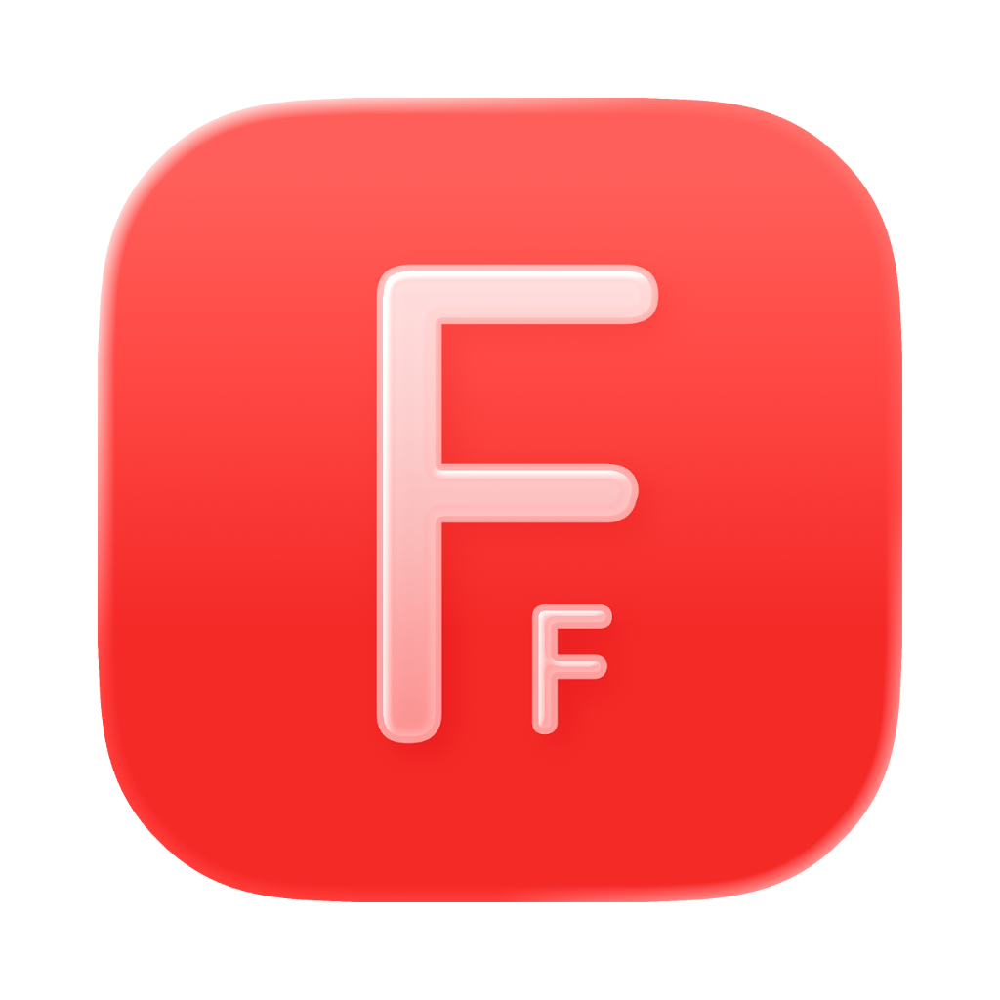
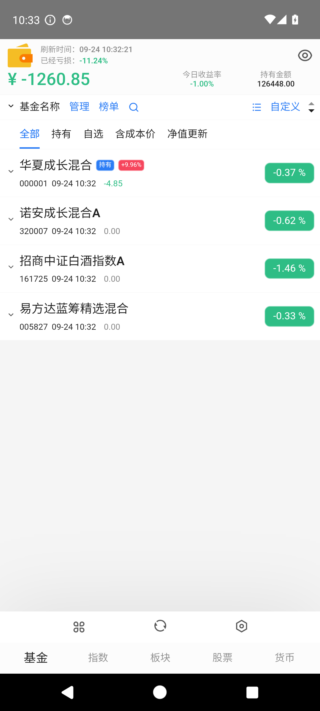
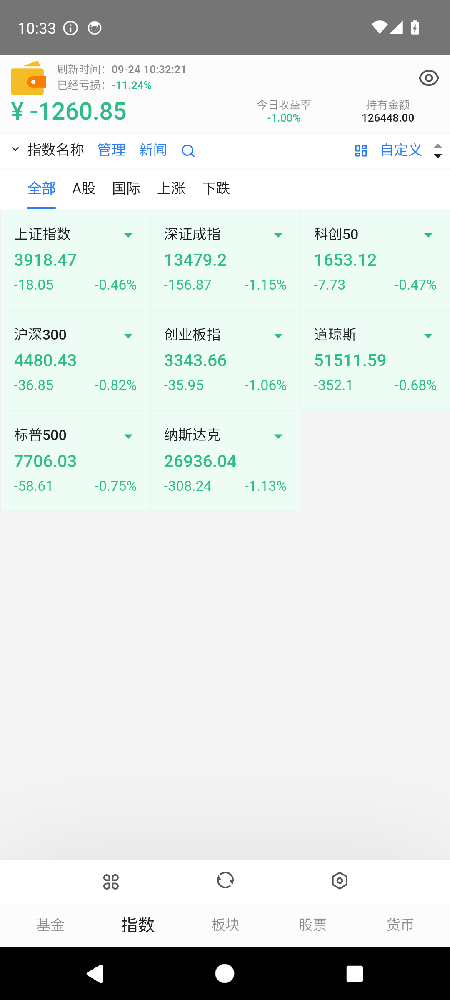
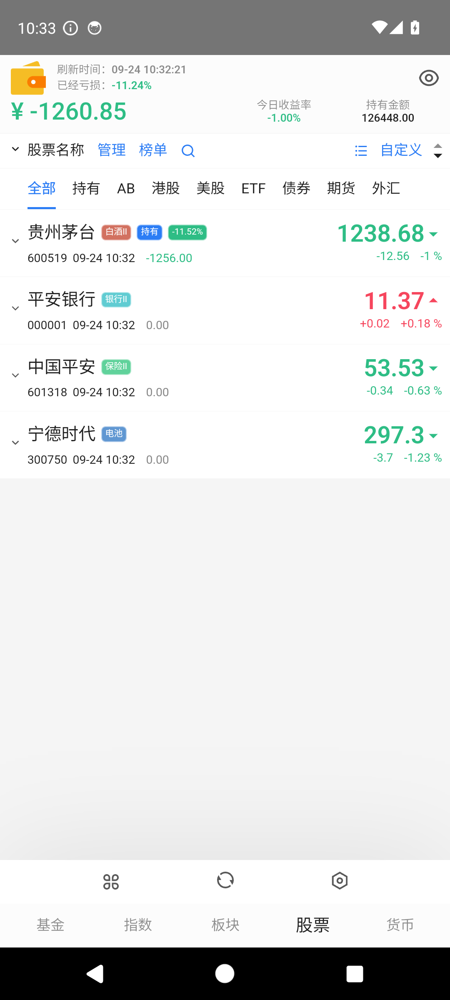
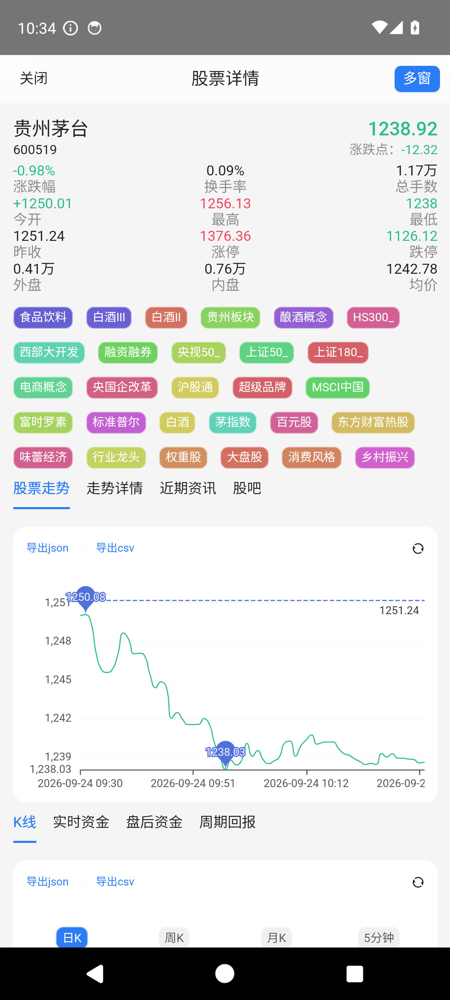

<p align="center">
  
</p>

<h1 align="center">Fishing Funds（个人维护版）</h1>

<p align="center">
  
  
  
  
</p>

> 股票 · 基金 · 大盘指数 · 板块 · 加密货币 的**行情常驻工具**。
> 桌面端（macOS / Windows / Linux）基于 Electron 常驻菜单栏；
> **自 v8.7.1-fork.1 起新增安卓客户端**（Capacitor 6 原生壳），四端共用同一份渲染层代码。

## 截图

<p align="center">
  
  &nbsp;
  
  &nbsp;
  
</p>

<p align="center">
  
</p>

## 关于本仓库

- 本项目代码**派生自 [`1zilc/fishing-funds`](https://github.com/1zilc/fishing-funds) v8.7.1**（GPL-3.0），现由本仓库**独立维护，与上游不再同步**。
- 选择 v8.7.1 作为基线：官方 8.8.0 把数据层核心（东方财富反爬绕过逻辑）抽成了闭源子模块，公开源码无法独立编译。v8.7.1 数据层完整开源，**可自行构建、自行修复**，适合长期自维护。
- 官方自动更新已关闭，构建产物只来自本仓库代码。
- 完整的架构契约与维护手册见 [`ARCHITECTURE.md`](ARCHITECTURE.md) / [`AGENTS.md`](AGENTS.md)，人类操作手册见 [`FORK_README.md`](FORK_README.md)。

## 本次新增：安卓客户端

`android-capacitor` 分支把同一份 `src/renderer` 装进了 Capacitor 6 壳，与桌面三端共用全部业务代码，
平台差异只通过 `window.contextModules` 桥隔离（安卓侧由原生插件 [`ContextModulesPlugin.java`](android/app/src/main/java/com/thecoolboyhan/fishingfunds/plugins/ContextModulesPlugin.java) 实现）。

**这次安卓化过程顺带修掉的问题**（部分同样影响桌面端）：

| 类别 | 问题 | 后果 |
|---|---|---|
| 存储 | `electronStore` 双重编码：写数组/对象，读回来是字符串 | 钱包配置解析静默失效，新增的自选重启后丢失 |
| 存储 | `storeCover` 在参数非法时先 `clear()` 再什么都不写 | 整个命名空间被静默清空（恢复备份会丢全部配置） |
| 网络 | 原生栈被服务端按客户端指纹掐断，而 WebView 的 `fetch` 能通 | 股票 / 指数 / 分时 / K线 数据全空 |
| 时序 | 持久化监听器注册晚于初始化 dispatch | 首次启动的配置写入全部丢失，永不落盘 |
| 导出 | `saveJsonToCsv` 漏掉所有数据行 | 导出只有 BOM 的空 CSV |
| UI | 移动端 CSS 用了裸媒体查询、给所有按钮加 `min-height` | 误伤 325px 宽的桌面小窗；工具栏文字向上溢出 |

其中「双网络栈互补」是关键：原生 OkHttp 栈与 WebView 的浏览器栈**能力互补**——
前者能读无 CORS 头的静态数据，后者在部分接口上能绕过服务端的客户端指纹识别。两者互为兜底，
 任一条单独存在都会丢一半数据。

## 功能特性

- 实时显示基金涨跌与估算收益、大盘指数、板块行情、个股走势、加密货币行情
- 多钱包管理、持有份额与成本价、收益 / 收益率统计
- 支持 OpenAI 兼容接口用于基金一键录入等 AI 功能，不收集、不上传用户的 API Key
- 纯个人自用状态栏小插件，完全开源免费，仅供学习交流
- **安卓端**：全屏适配、触摸友好的字号（基准 13px，可在设置中调到 16px）、首次启动内置示例自选便于上手

> ⚠️ 软件中所有数据仅供参考，收益或亏损以当天实际为准；走势、排行数据均来自第三方网站，不代表作者观点。

## 数据源与网络可用性

基金估值支持多数据源，可在「设置 → 基金接口」切换。**不同网络环境下可用性不同**，以下为实测记录：

| `fundApiTypeSetting` | 源 | 端点 | 实测（受限网络出口） |
|---|---|---|---|
| 0 | 东方财富-天天基金 | `fundgz.1234567.com.cn` | ★★★★★（推荐，最快最准；但部分网络出口会被 CDN 返回缓存的 404 页） |
| 1 | 腾讯证券 | `web.ifzq.gtimg.cn` | ★☆☆☆☆（上游接口已下线，返回 `interface offline`） |
| 2 | 支付宝-蚂蚁基金 | `www.fund123.cn` | ★★★☆☆ |
| 3 | 同花顺-爱基金 | `fund.10jqka.com.cn` | ★★★★☆（受限网络下的可靠备选） |

> ⚠️ 若基金列表为空、且能确认不是代码问题，先切换数据源试试。排查思路见 [`ARCHITECTURE.md`](ARCHITECTURE.md) §5。

## 下载

所有安装包都发布在 [**Releases**](https://github.com/thecoolboyhan/fishing-funds/releases)。

### 桌面端（macOS / Windows / Linux）

> macOS 不允许直接打开未签名程序，若无法打开请执行：

```bash
sudo xattr -d com.apple.quarantine "/Applications/Fishing Funds.app"
```

或进入「系统设置」→「隐私与安全性」→「仍要打开」。

### 安卓端

1. 下载 Release 里的 `fishing-funds-android-*.apk`
2. 允许「安装未知来源应用」后安装（自签名包，不含任何第三方 SDK / 统计）
3. 首次启动会内置 4 只基金 + 4 只股票的示例自选，方便直接体验；在界面上删除或替换即可

> ⚠️ debug 包与 release 包签名不同，二者切换必须先卸载旧版（会清掉本地配置）。
> 应用升级请使用同一签名的连续版本，`versionCode` 会随发布递增。

## 从源码构建

### 桌面端

```bash
npm install --ignore-scripts       # 跳过会下载二进制的 postinstall
node node_modules/electron/install.js
npm run build                      # 产出 release/app/dist
npm run package-mac                # 打包 macOS dmg（未签名）
```

> 开发热更新（`npm run dev`）依赖 bun；`build` / `package-*` 仅需 electron-vite + electron-builder，无需 bun。

### 安卓端

```bash
npm install
npm run build
npx cap sync android               # 把 web 资源同步进 android/ 工程
cd android && ./gradlew assembleDebug     # 需 JDK 17 + ANDROID_HOME
```

- 发布签名读取 `android/keystore.properties`（与 `*.jks` 均不入库）；缺失时自动回退为不签名，构建不会失败
- 详细步骤、签名密钥管理与发布流程见 [`AGENTS.md`](AGENTS.md) §8

## 已知边界

| 平台 | 限制 |
|---|---|
| 安卓 | 原生弹窗 / 文件选择器是安全默认值（一律按「取消」），因此**删除自选、导出 CSV/JSON、备份导入导出不生效** |
| 安卓 | 新闻「查看原文」依赖桌面 `<webview>` 标签，暂不可用 |
| 通用 | 货币接口（`api.coingecko.com`）在受限网络下需要代理（见下节） |
| 通用 | 未做 release 混淆（`minifyEnabled false`），APK 体积约 4.4 MB |

## 系统代理

- 由于网络原因，部分货币接口可能无法直接访问，桌面端已适配系统代理访问
- 支持 HTTP 代理、SOCKS 代理
- 将以下货币接口加入你的代理软件规则并重启应用即可：

```
api.coingecko.com
api.coincap.io
```

## AI 识别录入

支持 AI 识别截图导入基金数据，需使用具备视觉能力的大模型（推荐 gpt-4o、grok、gemini-2.5-pro、qwen2.5vl:32b 及以上）。

> 注意 ⚠️：请确保接口地址安全，应用不保证识别过程中的数据不会泄露至第三方，使用前请完全了解该功能。

- 使用 OpenAI 兼容接口，在「设置 - AI」中配置请求地址与 API Key
- 进入某宝 - 理财 - 总资产 - 我的资产 - 全部持有
- 长截图，保证暴露基金名称、持有收益、累计收益三项数据

## 导入导出

右键菜单支持导入 / 导出基金 JSON 配置，便于备份。

```typescript
// 字段说明
interface FundSetting {
  code: string; // 基金代码（必填）
  name?: string; // 基金名称
  cyfe?: number; // 持有份额
  cbj?: number; // 持仓成本价
}
```

示例：

```json
[
  { "code": "320007", "name": "诺安成长混合", "cyfe": 1000.0, "cbj": 1.6988 },
  { "code": "161725", "name": "招商中证白酒指数(LOF)", "cyfe": 1000.0, "cbj": 1.4896 }
]
```

## 配置同步

- 在设置中开启后，自动将配置文件存储至指定路径，启动时优先读取该路径配置
- 通过 iCloud、OneDrive 等方式同步该文件至云端，实现多设备配置同步
- 支持钱包、基金、指数、板块、股票、货币、H5 配置同步

## 问题反馈

- 有问题或建议请在本仓库提交 **Issue**：<https://github.com/thecoolboyhan/fishing-funds/issues>
- 如果本项目对你有帮助，欢迎点个 Star ⭐

## 致谢

本项目的 UI 与数据层代码派生自 [`1zilc/fishing-funds`](https://github.com/1zilc/fishing-funds) v8.7.1，并在此基础上独立维护。同时感谢以下开源项目：

- [electron-vite](https://github.com/alex8088/electron-vite)
- [menubar](https://github.com/maxogden/menubar)
- [Capacitor](https://github.com/ionic-team/capacitor)
- [Ant Design](https://github.com/ant-design/ant-design/)
- [ahooks](https://github.com/alibaba/hooks)
- [echarts](https://github.com/apache/echarts)
- [Remix Icon](https://github.com/Remix-Design/RemixIcon)

## 许可证

本项目基于 **GPL-3.0** 开源。原项目及本派生版本均遵循 GPL-3.0：个人自用 / 自构建零义务；若对外发布，须保持 GPL-3.0 并公开你的修改源码。

- [LICENSE](LICENSE)
